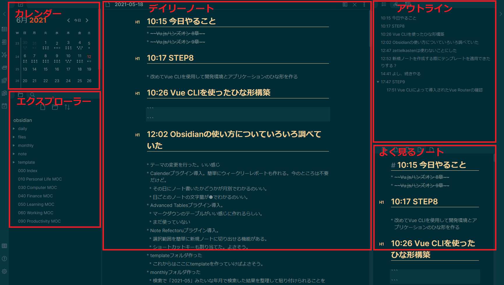
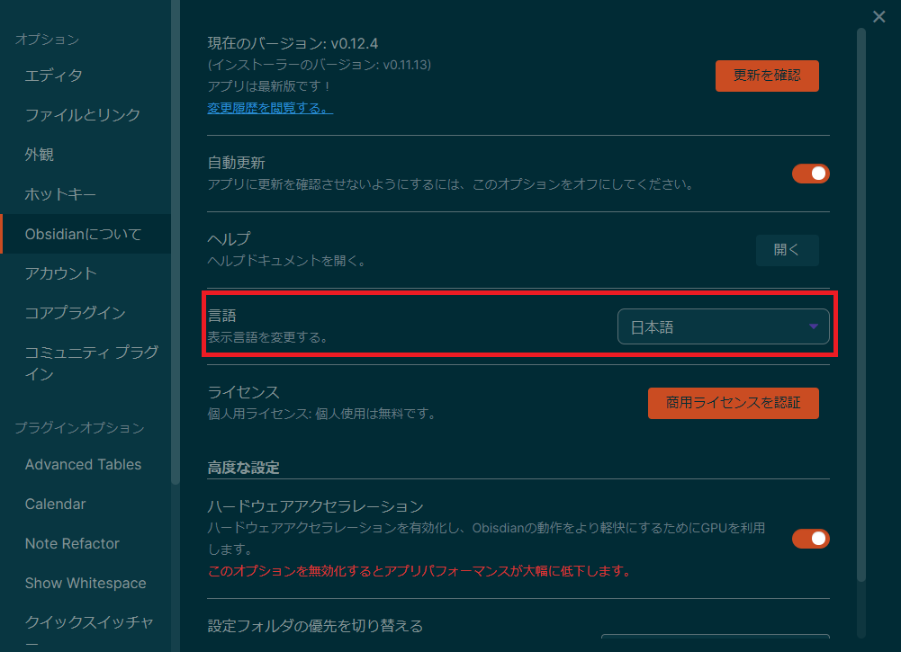
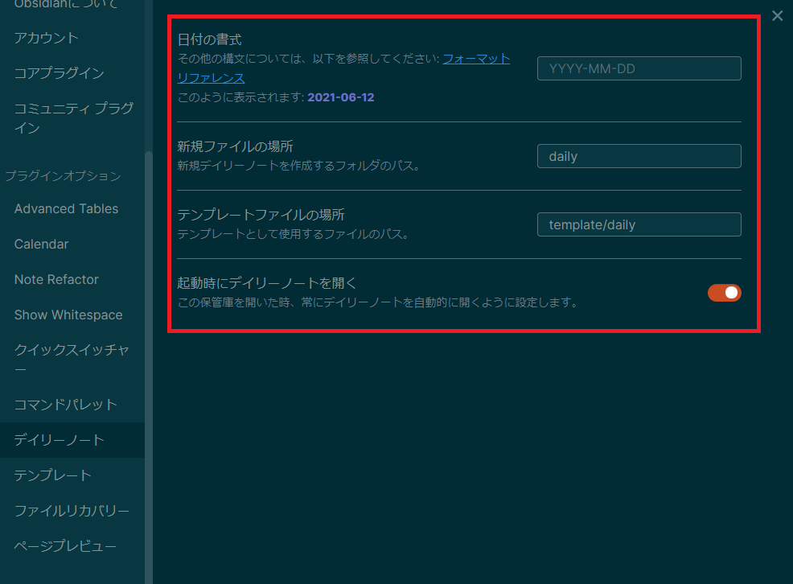
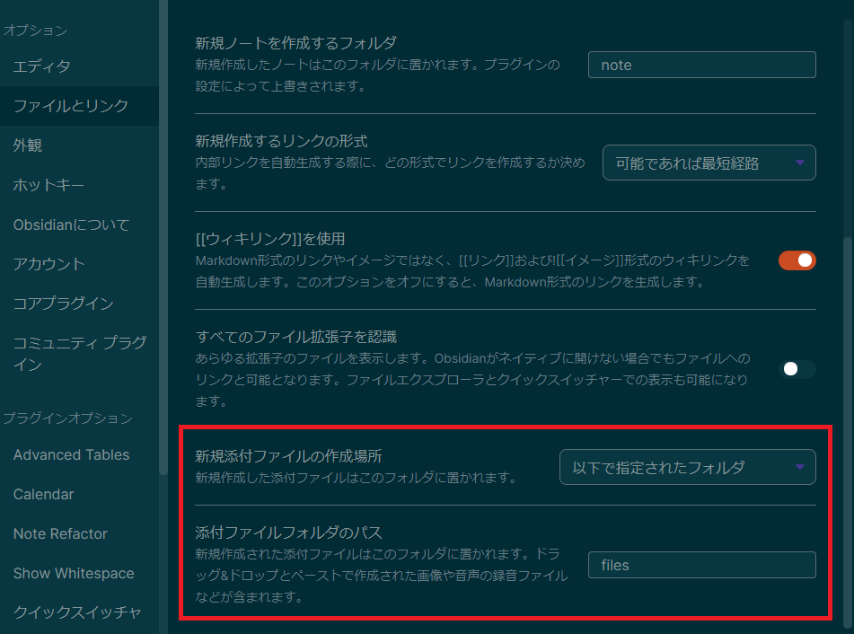
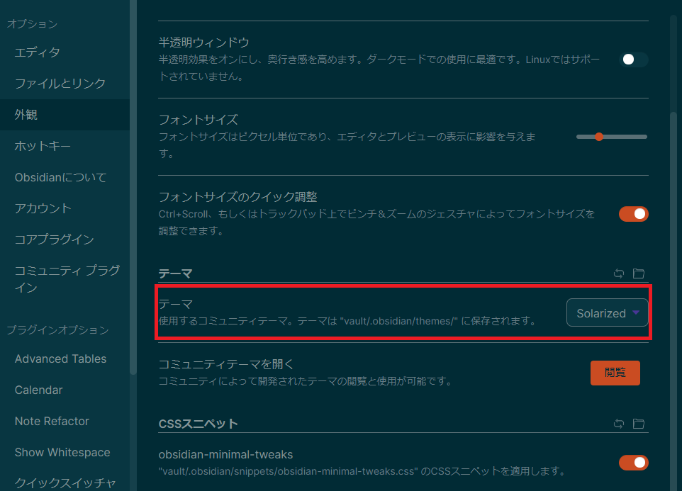
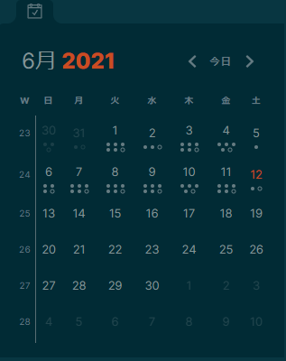
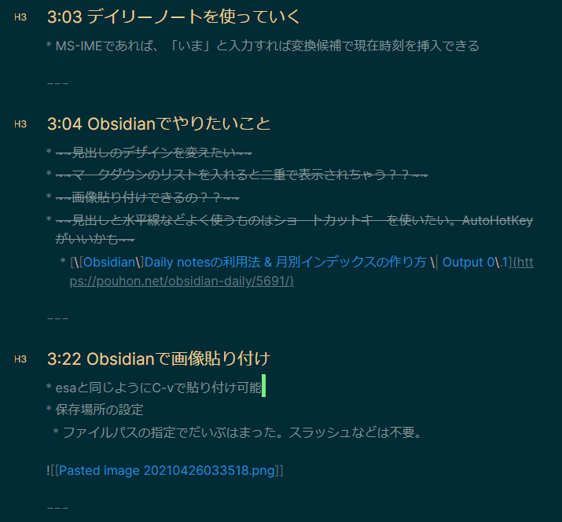
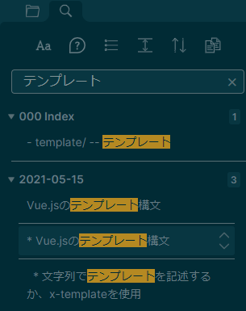

[Obsidian](https://obsidian.md/)はノートアプリです。  
次のような特長があります。  
ほかにもできることは多いノートアプリなのでもし気になった人は公式サイトを見てみるとよいです。

- 個人使用は無料
- ローカルで使える
- マークダウンが使える
- デイリーノートが使える
- ペインを自由に配置
- ノート同士をつなげられる
- vim が使える

Obsidian を使う前はいろいろノートアプリを使っていて、最近は esa に落ち着いていましたが  
1 年以上使っていると記事数も 1000 を超えてきて検索も少し重かったりでそろそろいいノートアプリ出てないか探したタイミングで Obsidian を使ってみました。  
ローカルで使えるのでオフラインで使えますし、まだ記事数が少ないのもあり重さも全く気になりません。  
デフォルトで RoamResearch のようなデイリーノートをサポートしてますし、Scrapbox のようにノート同士を繋げることもできて今のところ困ったことはなく使えています。  
せっかくなので、ここ１か月で行った設定に焦点を当て Obsidian の良さを伝えていこうと思います。

## どうやって運用している？

私の普段のペインの配置です。

- カレンダー -- デイリーノートを探す用です。
- エクスプローラー -- ノートを探すときに使います。
- デイリーノート -- 作業ログを書き込んでいきます。
- アウトライン -- いま開いているノートのアウトラインを表示させています。
- よく見るノート -- よく見るノートは右下に配置しています。



Obsidian はこのように好きな場所に好きなペインを配置できるのでとても効率敵に使うことができるのでおすすめです!  
私は基本的に

- ① デイリーノートに作業ログを書く
- ② 何度も見返す情報などはノートに整理する
- ③ 整理したノートはすぐに見つけられるように MOC ノートに整理する
  ②、③ は IMF-v3 という考え方にのっとっています。
  私が参考にしているのは下記です。
- http://ryokbys.web.nitech.ac.jp/posts/2020/08/my-obsidian-workflow/
  - このワークフローにのっとって情報を整理することでかなり使いやすさがマシマシになったと感じています。
  - 最初はデイリーノートから慣れていき、徐々にデイリーノート以外にノートを作成するようになってきたらこのワークフローの考え方を取り入れるとかなり快適に情報が整理できてアクセスしやすくなると思います。

## 基本設定編

では、設定編にまいりましょう。

### 日本語化する

日本語化された後の画面で申し訳ないですが、設定画面から言語を日本語に設定することができます。



### デイリーノートを使えるようにする

私は基本的に作業ログを取る人なので、日ごとに自動でその日の日付がタイトルのノートを作成されるととても助かります。  
そんな機能がデイリーノートです。  
日付が変わると自動でノートを作成してくれるのでかなり重宝しています。  
デフォルトでは、有効になっていないので有効にします。  
設定のプラグインのところから、デイリーノートを ON にするだけで有効になります。  
また、今日のディリーノートはショートカットキーが割り当てられており、デフォルトだと Alt+t で開けます。


また、デイリーノートの設定もできるのでカスタマイズしています。

下記の設定だと、daily というフォルダにデイリーノートが自動で作成されていきます。



### 記事に画像貼り付け

最近のノートアプリでは当たり前ですが、クリップボードにある画像を C-v で貼り付けることができます。  
esa でも同じことができていたのですが、Obsidian でもできたので Obsidian を使う理由の一つでもあります。  
デフォルトだとトップレベルの場所にファイルが保存されていくので、files というフォルダにファイルが保存されるようにしています。



### vim を使える設定にする

ノートアプリで vim が使えるアプリはそんな多くないと思いますが、なんと Obsidian は vim のキー設定にも対応しています。  
このおかげで快適に作業ログを書くことができています。  
エディタの設定から Vim のキー設定を ON にするだけです。


ここからは Obsidian のすごいと思ったところなのですが、なんと vimrc もプラグインでサポートしています。  
自分は少しだけここを変えたいという設定があったので導入しています。
設定のコミュニティプラグインのところから、「Vimrc Support」というプラグインをインストールし有効にします。  
設定ファイルを作成することで有効になります。
`VAULT_ROOT/.obsidian.vimrc`を作成する。
私は下記の設定をしています。

```javascript
" Yank to system clipboard
set clipboard=unnamed

" 論理行、表示行移動のマッピング
" https://motamemo.com/vim/vim-tips/real-display-line/
nnoremap k gk
nnoremap gk k
nnoremap j gj
nnoremap gj j
```

### 保存先を Dropbox にする

Obsidian では、ただのマークダウンファイルを作成しているだけです。
Obsidian の保管庫を Dropbox に置くだけで、クラウドで管理できるようになります。

Dropbox に保管庫を置いておけば、新しい PC に Obsidian をインストールして Dropbox の保管庫を指定するだけで今まで通りの設定やノートを使うことができます。

データが消えてしまう心配もありませんし、ほかのノートアプリへの記事移行も簡単です。

[Obsidian での複数 PC 間でのデータの共有方法 \| DailyMix News](https://dailymix-news.com/obsidian-share-file/)

### テーマを変える

Obsidian はいろんなテーマがあり、設定の外観から簡単にテーマを導入できます。

私は、Solarized にしています。



## 応用編

ここまでで十分普段づかいできるようになっていると思いますが、
もっとよくしていきたい編です。

### テンプレート

毎回使うひな形はテンプレート機能を使います。

設定等は下記がわかりやすいです。

[Obsidian のテンプレート機能 \| シゴタノ！](https://cyblog.jp/41914)

私のデイリーノートのテンプレート例です。

デイリーノートの設定で下記テンプレートで新規作成するようにしています。

```javascript
tags: #daily

# Tasks
- [ ] something

# Notes
```

### Calender プラグイン

Calender プラグインを入れると下記のようにカレンダーのペインが表示されます。
その日付をクリックすると、デイリーノートに飛びます。
デイリーノートも数が多くなってくると、フォルダから探すと大変なのでカレンダーから移動することでだいぶ楽になりました。
また、その日ごとの文字量が ● でわかるので一目でその日はどれくらい作業したかの目安にもなります。



下記の記事が参考になります。

簡単にウィークリーレポートを作成できたりします(私は活用できていません...)。

[Calendar プラグインで Daily notes は進化する](https://pouhon.net/obsidian-calendar/5996/)

### CSS スニペットで外観を調整する

Obsidian には CSS スニペットという機能があり、css を`VAULT_ROOT/.obsidian/snippets/`に配置するだけで、設定画面から CSS スニペットの有効/無効の切り替えができます。
手順は下記リポジトリを参考にしました。

[lucasrla/obsidian\-css\-tweaks: CSS snippet for Obsidian – just a few \(minimal\) tweaks and fixes](https://github.com/lucasrla/obsidian-css-tweaks)

ここを調整したいけど、やり方がわからない人は下記リポジトリが参考になると思います。

[obsidian\-css\-snippets/Snippets at master · Dmitriy\-Shulha/obsidian\-css\-snippets](https://github.com/Dmitriy-Shulha/obsidian-css-snippets/tree/master/Snippets)

また、私の CSS スニペットを参考においておきます。
たぶん、いい感じになると思います。

不要なら無効にするだけです。

`obsidian-minimal-tweaks.css`

```javascript
/* https://github.com/Dmitriy-Shulha/obsidian-css-snippets/blob/master/Snippets/Headers.md */

:root {
  --text-title-h1: rgb(239, 207, 146);
  --text-title-h2: rgb(239, 207, 146);
  --text-title-h3: rgb(239, 207, 146);
  --text-title-h4: rgb(239, 207, 146);
  --text-title-h5: rgb(239, 207, 146);
  --text-title-h6: rgb(239, 207, 146);
  --text-accent: rgb(239, 207, 146);
  --h1ys: rgb(239, 207, 146);
  --h2ys: rgb(239, 207, 146);
  --h3ys: rgb(239, 207, 146);
  --h4ys: rgb(239, 207, 146);
  --h5ys: rgb(239, 207, 146);
  --h6ys: rgb(239, 207, 146);
  --font-size-h1: 27px;
  --font-size-h2: 22px;
  --font-size-h3: 21px;
  --font-size-h4: 19px;
  --font-size-h5: 16px;
  --font-size-h6: 13px;
}

/* ========================================================== */

/* changing the color of the header in edit mode */
.cm-header-1 {
  color:var(--text-title-h1);
}

/* Coloured headings for editor and preview in Dracula */
.cm-header-1, .markdown-preview-view h1
{
  font-family: var(--font-family-editor);
  font-weight: 500;
  font-size: var(--font-size-h1);
  color: var(--text-title-h1);
}

.cm-header-2, .markdown-preview-view h2
{
  font-family: var(--font-family-editor);
  font-weight: 500;
  font-size: var(--font-size-h2);
  color: var(--text-title-h2);
}

.cm-header-3, .markdown-preview-view h3
{
  font-family: var(--font-family-editor);
  font-weight: 500;
  font-size: var(--font-size-h3);
  color: var(--text-title-h3);
}

.cm-header-4, .markdown-preview-view h4
{
  font-family: var(--font-family-editor);
  font-weight: 500;
  font-size: var(--font-size-h4);
  color: var(--text-title-h4);
}

.cm-header-5, .markdown-preview-view h5
{
  font-family: var(--font-family-editor);
  font-weight: 500;
  font-size: var(--font-size-h5);
  color: var(--text-title-h5);
}

.cm-header-6, .markdown-preview-view h6
{
  font-family: var(--font-family-editor);
  font-weight: 500;
  font-size: var(--font-size-h6);
  color: var(--text-title-h6);
} */

/* Coloured headings for editor and preview, same font-weight in Edit & Preview */
.cm-s-obsidian .cm-header-1,
 .markdown-preview-view h1 {
  font-weight: 450;
  color: var(--text-title-h1);
}

.cm-s-obsidian .cm-header-2,
 .markdown-preview-view h2 {
  font-weight: 450;
  color: var(--text-title-h2);
}

.cm-s-obsidian .cm-header-3,
 .markdown-preview-view h3 {
  font-weight: 450;
  color: var(--text-title-h3);
}

.cm-s-obsidian .cm-header-4,
 .markdown-preview-view h4 {
  font-weight: 450;
  color: var(--text-title-h4);
}

.cm-s-obsidian .cm-header-5,
 .markdown-preview-view h5 {
  font-weight: 450;
  color: var(--text-title-h5);
}

.cm-s-obsidian .cm-header-6,
 .markdown-preview-view h6 {
  font-weight: 450;
  color: var(--text-title-h6);
}

/* Underline H1 heading in Edit mode */
/* .cm-header-1 {
  border-bottom: 1px solid var(--text-accent);
} */

.cm-s-obsidian pre.HyperMD-header-1:after {
  content: "";
  position: absolute;
  bottom: 5px;
  left: 5px;
  width: calc(100% - 10px);
  height: 1px;
  background: rgb(239, 207, 146);
}


/* ========================================================== */


/* Eliminate margin (gap, space) under headings - Preview mode only */
/* H1 underlined too */
.markdown-preview-view h1 {
  padding-bottom: 5px;
  border-bottom: 1px solid rgb(239, 207, 146);
  margin-bottom: -10px;
}

.markdown-preview-view h2,
.markdown-preview-view h3,
.markdown-preview-view h4,
.markdown-preview-view h5,
.markdown-preview-view h6 {
margin-bottom: -20px;
padding-bottom: 5px;
}

/* Changing size/color of the header hashtags # */
.cm-formatting-header {
  color: var(--text-faint);
font-size: 0.6em;
}

/* USED IN CONTEXT OF "REMOVE CLUTTER" */
/* Replace header hashes (#) by H1, H2, etc. in edit mode */
/* from Blue Topaz theme: DIRTY WYSIWYM HEADERS by _ph */

/* Header folder icon */
.CodeMirror-foldgutter-open, .CodeMirror-foldgutter-folded {
  padding-left: -10px;
}

.CodeMirror-sizer{
  margin-left: 35px !important;
}

/*-- reduce left padding --*/
.CodeMirror {
  height: 100%;
  direction: ltr;
  padding: 0 5px;
}

/*-- hide # markup--*/
.cm-formatting.cm-formatting-header.cm-formatting-header-1.cm-header.cm-header-1,
.cm-formatting.cm-formatting-header.cm-formatting-header-2.cm-header.cm-header-2,
.cm-formatting.cm-formatting-header.cm-formatting-header-3.cm-header.cm-header-3,
.cm-formatting.cm-formatting-header.cm-formatting-header-4.cm-header.cm-header-4,
.cm-formatting.cm-formatting-header.cm-formatting-header-5.cm-header.cm-header-5,
.cm-formatting.cm-formatting-header.cm-formatting-header-6.cm-header.cm-header-6
{font-size:0.1px;}  /* 0pxにすると「#」に続けて日本語入力すると「#」が認識されなくなるので0.1pxとしている

/*-- display H1-h6 in gutter--*/
.cm-formatting.cm-formatting-header.cm-formatting-header-1.cm-header.cm-header-1:before{
  content:"H1";
  font-size:14px;
  color: var(--h1ys);
  left:-36.5px;
  top:11px;
  position:absolute;
}
.cm-formatting.cm-formatting-header.cm-formatting-header-2.cm-header.cm-header-2:before{
  content:"H2";
  font-size:13px;
  color: var(--h2ys);
  left:-36.5px;
  top:9px;
  position:absolute;
}
.cm-formatting.cm-formatting-header.cm-formatting-header-3.cm-header.cm-header-3:before{
  content:"H3";
  font-size:12px;
  color: var(--h3ys);
  left:-36.7px;
  top: 7px;
  position:absolute;
}
.cm-formatting.cm-formatting-header.cm-formatting-header-4.cm-header.cm-header-4:before{
  content:"H4";
  font-size:11px;
  color: var(--h4ys);
  left:-20.5px;
  top: 7px;
  position:absolute;
}
.cm-formatting.cm-formatting-header.cm-formatting-header-5.cm-header.cm-header-5:before{
  content:"H5";
  font-size:10px;
  color: var(--h5ys);
  left:-20px;
  top: 9px;
  position:absolute;
}
.cm-formatting.cm-formatting-header.cm-formatting-header-6.cm-header.cm-header-6:before{
  content:"H6";
  font-size:9px;
  color: var(--h6ys);
  left:-19.5px;
  top: 9px;
  position:absolute;
}

/*-- is active line, hide H[1-6] in gutter --*/
.CodeMirror-activeline span.cm-formatting.cm-formatting-header.cm-formatting-header-1.cm-header.cm-header-1:before,
.CodeMirror-activeline span.cm-formatting.cm-formatting-header.cm-formatting-header-2.cm-header.cm-header-2:before,
.CodeMirror-activeline span.cm-formatting.cm-formatting-header.cm-formatting-header-3.cm-header.cm-header-3:before,
.CodeMirror-activeline span.cm-formatting.cm-formatting-header.cm-formatting-header-4.cm-header.cm-header-4:before,
.CodeMirror-activeline span.cm-formatting.cm-formatting-header.cm-formatting-header-5.cm-header.cm-header-5:before,
.CodeMirror-activeline span.cm-formatting.cm-formatting-header.cm-formatting-header-6.cm-header.cm-header-6:before
{font-size:0px;}

/*-- is active line, display # markup --*/
.CodeMirror-activeline > pre > span .cm-formatting.cm-formatting-header.cm-formatting-header-1.cm-header.cm-header-1{
  font-size:24px;
  display:inline;
}
.CodeMirror-activeline > pre > span .cm-formatting.cm-formatting-header.cm-formatting-header-2.cm-header.cm-header-2{
  font-size:22px;
  display:inline;
}
.CodeMirror-activeline > pre > span .cm-formatting.cm-formatting-header.cm-formatting-header-3.cm-header.cm-header-3{
  font-size:20px;
  display:inline;
}
.CodeMirror-activeline > pre > span .cm-formatting.cm-formatting-header.cm-formatting-header-4.cm-header.cm-header-4{
  font-size:18px;
  display:inline;
}
.CodeMirror-activeline > pre > span .cm-formatting.cm-formatting-header.cm-formatting-header-5.cm-header.cm-header-5{
  font-size:16px;
  display:inline;
}
.CodeMirror-activeline > pre > span .cm-formatting.cm-formatting-header.cm-formatting-header-6.cm-header.cm-header-6{
  font-size:16px;
  display:inline;
}

/* Change header size in Edit mode */
.cm-header-1 {
  font-size: var(--font-size-h1);
}

.cm-header-2 {
  font-size: var(--font-size-h2);
}

.cm-header-3 {
  font-size: var(--font-size-h3);
}

.cm-header-4 {
  font-size: var(--font-size-h4);
}

.cm-header-5 {
  font-size: var(--font-size-h5);
}

.cm-header-6 {
  font-size: var(--font-size-h6);
}

/* Change header size in Preview mode */
.markdown-preview-view h1 {
  font-size: var(--font-size-h1);
}

.markdown-preview-view h2 {
  font-size: var(--font-size-h2);
}

.markdown-preview-view h3 {
  font-size: var(--font-size-h3);
}

.markdown-preview-view h4 {
  font-size: var(--font-size-h4);
}

.markdown-preview-view h5 {
  font-size: var(--font-size-h5);
}

.markdown-preview-view h6 {
  font-size: var(--font-size-h6);
  font-weight: bold;
}
```

## 小技集

### C-e でプレビューに切り替え

大体のマークダウンのプレビューは左にプレビュー前、右にプレビュー後のものが表示されるかと思いますが、Obsidian の場合は 1 画面でプレビュー前/プレビュー後と切り替えられるので目線が左右に移動せずにかなり使いやすいです。

基本はプレビュー前の状態でゴリゴリ書いていって、プレビューを見たいときだけ C-e で切り替えて確認したら C-e でプレビュー前に戻して書くという感じで使っています。

プレビュー前です。



プレビュー後です。


### C-S-f で全てのノートから検索

Obsidian はオフラインなので全てのノートからの検索が早くストレスがないです。

C-S-f を押下すると、検索欄にフォーカスされるのですぐに検索して目的の情報に到達できます。



### 月別インデックスを作成する

Obsidian のすごいなーと思った機能で検索バーで検索した結果から簡単に月別インデックスが作れます。
ほかにも応用ができそうな機能です。

[Daily notes の利用法 & 月別インデックスの作り方](https://pouhon.net/obsidian-daily/5691/)

## まとめ

どうだったでしょうか？

思った以上に Obsidian は優秀だったと思います。

プラグインを入れればさらにできることは広がります。

多機能ではありますが、少しずつ設定をしていけば問題ないのでまずはデイリーノートだけでも使ってみる価値はあると思います。

Obsidian で快適なノートライフを送りましょう！
