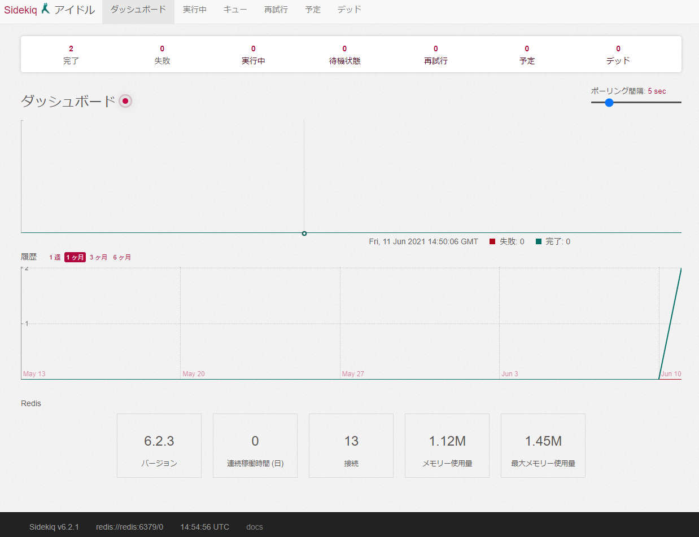

今まで Redis と Sidekiq を使ったことがなかったので docker-compose で環境を作ってみようと思います。  
せっかくなので、DB は MySQL ではなく PostgreSQL にしてみました。特に意味はありません！  
一通り動作確認できることが今回のゴールです。

## プロジェクトの作成

```javascript
mkdir -p ~/tmp/sample-rails
cd ~/tmp/sample-rails
```

## Dockerfile の作成

Ruby: 2.6.5

```javascript
vi Dockerfile
```

```javascript
FROM ruby:2.6.5

RUN apt-get update -qq && \
apt-get install -y build-essential \
                   libpq-dev \
                   nodejs

RUN mkdir /app
ENV APP_ROOT /app
WORKDIR $APP_ROOT
COPY ./Gemfile $APP_ROOT/Gemfile
COPY ./Gemfile.lock $APP_ROOT/Gemfile.lock
RUN bundle install
COPY . $APP_ROOT
```

## Gemfile の作成

Rails: 5.2.6

```javascript
vi Gemfile
```

```javascript
source 'https://rubygems.org'
gem 'rails', '5.2.6'
```

## Gemfile.lock の作成

```javascript
touch Gemfile.lock
```

## docker-compose.yml の作成

```javascript
vi docker-compose.yml
```

```javascript
version: '3'
services:

  web:
build: .
tty: true
stdin_open: true
command: rails s -p 3000 -b '0.0.0.0'
volumes:
  - .:/app
  - bundle_data:/usr/local/bundle
ports:
  - "3000:3000"
depends_on:
  - db
  - redis
environment:
  REDIS_URL: redis://redis:6379

  db:
image: postgres
volumes:
  - postgres:/var/lib/postgresql/data
ports:
  - "5432:5432"
environment:
  POSTGRES_USER: root
  POSTGRES_PASSWORD: app_dev_password
  POSTGRES_DB: app_dev

  redis:
image: redis
command: redis-server --appendonly yes
ports:
  - "6379:6379"
volumes:
  - redis:/var/lib/redis/data

  sidekiq:
build: .
command: bundle exec sidekiq
volumes:
  - .:/app
  - bundle_data:/usr/local/bundle
depends_on:
  - db
  - redis
environment:
  REDIS_URL: redis://redis:6379

volumes:
  bundle_data:
  postgres:
  redis:
```

## プロジェクトをビルド

```javascript
docker-compose run web rails new . --force --database=postgresql --skip-bundle
```

WSL 上の Ubutu 環境なので下記コマンドを実行しておく

```javascript
sudo chown -R 1000:1000 .
```

## database.yml の編集

```javascript
vi config/database.yml
```

```javascript
default: &default
  adapter: postgresql
  encoding: unicode
  host: db
  username: root
  password: app_dev_password
  pool: <%= ENV.fetch("RAILS_MAX_THREADS") { 5 } %>
```

## コンテナビルド&起動

**この時点では sidekiq コンテナは起動に失敗します。**

```javascript
docker-compose build
docker-compose up
```

## gem インストール

Gemfile に追加。

```javascript
gem 'sidekiq'
```

bundle install する。

```javascript
docker-compose run web bundle install
```

## sidekiq の設定

routes に追加。

```javascript
require 'sidekiq/web'

Rails.application.routes.draw do
  mount Sidekiq::Web, at: '/sidekiq'
end
```

`config/initializers/sidekiq.rb`を作成する。

```javascript
Sidekiq.configure_server do |config|
  config.redis = { url: ENV["REDIS_URL"] }
end

Sidekiq.configure_client do |config|
  config.redis = { url: ENV["REDIS_URL"] }
end
```

## DB 作成

```javascript
docker-compose run web rails db:create
```

## 再度起動しなおす

sidekiq の gem を入れたので今度は全てのコンテナが起動する。

```javascript
docker-compose down
docker-compose up
```

## http://localhost:3000/ にアクセス

いつもの画面が表示されていれば OK。


## sidekiq が動作するか確認する

ワーカーを作成する。

```javascript
docker-compose exec web rails g sidekiq:worker Hello
```

下記ファイルが作成される。

```javascript
create  app/workers/hello_worker.rb
create  test/workers/hello_worker_test.rb
```

`app/workers/hello_worker.rb`を編集する。

```javascript
class HelloWorker
  include Sidekiq::Worker

  def perform(*args)
puts "Hello"
  end
end
```

sidekiq はファイルを編集したら再度起動しないと読み込まないらしいので再起動。

```javascript
docker-compose down
docker-compose up
```

ワーカーをキューに登録する。
正常に登録されると、ID のような文字列が表示される。

```javascript
docker-compose exec web rails c
irb(main):001:0> HelloWorker.perform_async
=> "702ce6a25525ee495fac36ef"
```

キューに登録したワーカーはすぐに実行される。
sidekiq コンテナのログを確認する。

```javascript
sidekiq_1  | 2021-06-11T14:53:41.775Z pid=1 tid=grbnhzgoh class=HelloWorker jid=702ce6a25525ee495fac36ef INFO: start
sidekiq_1  | Hello
sidekiq_1  | 2021-06-11T14:53:41.775Z pid=1 tid=grbnhzgoh class=HelloWorker jid=702ce6a25525ee495fac36ef elapsed=0.0 INFO: done
```

Hello が出力されていることが確認できた。
また、 http://localhost:3000/sidekiq にアクセスすると、次のようにダッシュボードが表示されます。


## Redis が動作しているか確認する

```javascript
docker-compose exec redis /bin/bash
```

いちおう、redis-cli 動作して値が保存されていることは確認できたが、
sidekiq のキューが保存されているかなどはいまいち理解できていないので次回の宿題としたい。

```javascript
root@d0444689a353:/data# redis-cli
127.0.0.1:6379> keys *
1) "stat:failed:2021-06-11"
2) "queues"
3) "processes"
4) "stat:failed"
5) "stat:processed:2021-06-11"
6) "stat:processed"
7) "25ef69e9cc2a:1:3caa06ecd9cc"
```

## 参考：docker-compose.yml の説明

### web コンテナの説明

```javascript
  web:
build: .
tty: true
stdin_open: true
command: rails s -p 3000 -b '0.0.0.0'
volumes:
  - .:/app
  - bundle_data:/usr/local/bundle
ports:
  - "3000:3000"
depends_on:
  - db
  - redis
environment:
  REDIS_URL: redis://redis:6379
```

build

- Dockerfile を参照してイメージをビルド
  tty, stdin_open
- [docker run \-it で学ぶ tty とか標準入出力とかファイルディスクリプタとか \- valid,invalid](https://ohbarye.hatenablog.jp/entry/2019/05/05/learn-tty-with-docker)
- tty: 制御するターミナル(デバイス)を割り当てる？これがないとターミナルでの操作ができないようなイメージ
- stdin_open: 標準入力を受け付ける？これがないとターミナルはあるけど、入力コマンドを打っても受け付けないイメージ
  command
- [docker \- コマンドは docker\-compose\.yml と Dockerfile のどちらで定義するほうがいい？ \- スタック・オーバーフロー](https://ja.stackoverflow.com/questions/30495/%E3%82%B3%E3%83%9E%E3%83%B3%E3%83%89%E3%81%AFdocker-compose-yml%E3%81%A8dockerfile%E3%81%AE%E3%81%A9%E3%81%A1%E3%82%89%E3%81%A7%E5%AE%9A%E7%BE%A9%E3%81%99%E3%82%8B%E3%81%BB%E3%81%86%E3%81%8C%E3%81%84%E3%81%84)
- `docker-compose up`でコンテナ起動時に実行されるコマンド ※build の CMD はビルド時にしか実行されないので、コンテナ起動時に実行したいコマンドはこっちに記載する
- `-p` サーバーを起動するときのポート番号
- `-b` バインドする IP アドレスを指定
  volumes
- `.:/app` でコンテナの/app ディレクトリをホストのカレントディレクトリにマウントする
- `bundle_data:/usr/local/bundle` でコンテナの gem データを名前付きのデータボリューム`bundle_data`(Docker Engine 上に確保した領域)にマウントしてデータを永続化する。
  depends_on
- [docker\-compose depends_on と links の違い \- Qiita](https://qiita.com/sivertigo/items/9baa73d922a68788402b)
- コンテナが`db, redis` => `web`の順で起動する。
- version2 以降は compose ファイルに書かれたすべてのサービス間に自動的にリンクを張る仕様らしい。なのでサービス名やエイリアス名で接続できるらしい。link などの指定は不要。

### docker-compose.yml: db コンテナの説明

```javascript
  db:
image: postgres
volumes:
  - postgres:/var/lib/postgresql/data
ports:
  - "5432:5432"
environment:
  POSTGRES_USER: root
  POSTGRES_PASSWORD: app_dev_password
  POSTGRES_DB: app_dev
```

[postgres](https://hub.docker.com/_/postgres)
image

- PostgreSQL のイメージ指定
  volumes
- デフォルトで PostgreSQL のデータは`var/lib/postgresql/data`に保存される。名前付きのデータボリューム`db_data`(Docker Engine 上に確保した領域)にマウントしてデータを永続化する。
  environment
- `POSTGRES_USER` 任意。`POSTGRES_PASSWORD`と併せて使用。指定したユーザーにスーパーユーザー権限を付与。
- `POSTGRES_PASSWORD` 必須。スーパーユーザーのパスワードを指定。
- `POSTGRES_DB` 任意。データベースの名前指定。指定しなければ`POSTGRES_USER`の値が使用される。

### docker-compose.yml: redis コンテナの説明

```javascript
  redis:
image: redis
command: redis-server --appendonly yes
ports:
  - "6379:6379"
volumes:
  - redis:/var/lib/redis/data
```

redis

- [Redis のデータ永続化](https://www.sraoss.co.jp/tech-blog/redis/redis-persistdata/)
- [Redis Persistence – Redis](https://redis.io/topics/persistence)
- 最も人気あるキーバリューストア
- Redis は「REmote DIctionary Server」という意味
  image
- redis のイメージ指定
  command
- AOF の有効化

### docker-compose.yml: sidekiq コンテナの説明

```javascript
  sidekiq:
build: .
command: bundle exec sidekiq
volumes:
  - .:/app
  - bundle_data:/usr/local/bundle
depends_on:
  - db
  - redis
environment:
  REDIS_URL: redis://redis:6379
```

build

- web と同じ Dockerfile を使う
  comand
- sidekiq を実行

## 参考にした記事など

[docker\-compose で mysql\+redis\+sidekiq な rails 環境を作る \- Qiita](https://qiita.com/t-taira/items/dc1714daaa48a051f46a)

[sinatra と sidekiq を組み合わせて、簡単な Web API を作ってみた \- tkak's tech blog](https://tkak.hatenablog.com/entry/2016/01/03/100603)

[Sidekiq の導入から ECS デプロイまで](https://zenn.dev/kos31de/articles/3f3dd49fa22d99)

[Quickstart: Compose and Rails \| Docker Documentation](https://docs.docker.com/samples/rails/)

[sidekiq の使い方 \- Qiita](https://qiita.com/nysalor/items/94ecd53c2141d1c27d1f)
