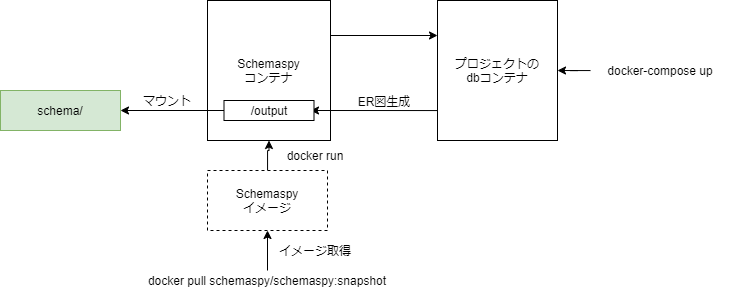

新しいプロジェクトは Docker + Rails + PostgreSQL で開発しており、 「rails er 図」で調べると大体 rails-ERD が候補で上がってきます。

プロジェクトには導入されていないので、個人的に毎回追加して bundle install するのも面倒だなーと思っていたら [Schemaspy](http://schemaspy.org/)を見つけました。

Schemaspy で生成されるサンプルドキュメントは[こちら](http://schemaspy.org/sample/index.html)で確認できます。

## Schemaspy コンテナから ER 図を生成

Schemaspy は[Docker イメージ](https://hub.docker.com/r/schemaspy/schemaspy/)が提供されているため、今回の方法を使えば既存のプロジェクトに影響を与えることなく ER 図を生成できます。

イメージはこんな感じです。

Schemaspy コンテナを起動して、プロジェクトの DB コンテナを読み取って ER 図を生成。

Schemaspy コンテナの`/output`に出力されます。

Schemaspy コンテナの`/output`はホストの`/schema`にマウントさせるので、ホスト側の`schema/index.html`をブラウザで開いて ER 図を確認できるようになります。

特にプロジェクト側に何かを追加する必要はないので、プロジェクトに手を加えずに ER 図を出力することができます。



### 手順

`docker pull`で schemaspy のイメージを取得。

```javascript
docker pull schemaspy/schemaspy:snapshot
```

`docker-compose up`等でプロジェクトの db コンテナを起動しておきます。
Schemaspy を使って ER 図を生成します。
今回対象の DB は postgreSQL になります。

```javascript
docker run -v "$PWD/schema:/output" --net="host" -u root:root schemaspy/schemaspy:snapshot -t pgsql -host localhost:5432 -db app_development -u root -p app_dev_password -connprops useSSL\\\\=false -all

# 上記コマンドの説明
docker run -v "[ホスト側のディレクトリ]:/output" --net="host" -u root:root schemaspy/schemaspy:snapshot -t [データベースの種類] -host localhost:[DBの接続ポート] -db [DB名] -u [DBのユーザー名] -p [DBのパスワード] -connprops useSSL\\\\=false -all
```

ホスト側の`$PWD/schema`に出力されるのでホスト側の`schema/index.html`をブラウザで開いて ER 図確認します。

出力する際に Graphviz がないために下記のエラーがでますが、Graphviz がなくてもとりあえず ER 図は確認できました。

```javascript
ERROR - dot -Tpng:cairo clients.2degrees.dot -oclients.2degrees.png -Tcmapx: in label of node inspections
ERROR - dot -Tpng:cairo clients.2degrees.dot -oclients.2degrees.png -Tcmapx: Warning: cell size too small for content
```

## 参考

[Docker でサクッと MySQL 8 から ER 図を作成する \- Qiita](https://qiita.com/ngyuki/items/4efa0734e8d8582bfc16)
