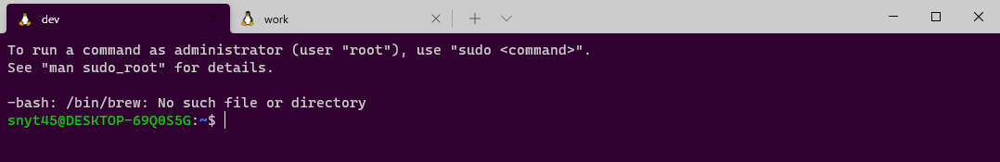
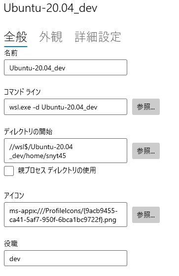
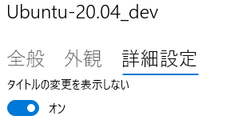

## 変更後の Windows Terminal

最終的にはこのような状態を目指します。



## 最終的な Windows Terminal の設定

settigns.json

```javascript
"profiles":
{
    "defaults": {},
    "list":
    [
        {
            "background": "#300030",
            "guid": "{a32514ec-a5a8-556e-a6a1-a1d48b6f0d84}",
            "hidden": false,
            "name": "Ubuntu-20.04_dev",
            "source": "Windows.Terminal.Wsl",
            "startingDirectory": "//wsl$/Ubuntu-20.04_dev/home/snyt45",
            "suppressApplicationTitle": true,
            "tabColor": "#300030",
            "tabTitle": "dev"
        },
        ...
    ]
},
```

## タブ色を変更する

`tabColor`で設定できます。

```javascript
"tabColor": "#300030"
```

## 背景色を変更する

`background`で設定できます。

```javascript
"background": "#300030"
```

## タブ名を変更する

`tabTitle`で設定できます。

Ubuntu の場合は、`suppressApplicationTitle`を true に設定する必要がありました。

```javascript
"suppressApplicationTitle": true,
"tabTitle": "dev"
```

GUI から設定する場合

日本語訳？がおかしいですが、役職の欄に入力した内容がタブ名になります。



タイトルの変更を表示しないをオンにします。

`suppressApplicationTitle`にあたります。



## 参考

[Windows ターミナルのタブのタイトルの設定 \| Microsoft Docs](https://docs.microsoft.com/ja-jp/windows/terminal/tutorials/tab-title#set-the-shells-title)

[Windows Terminal Tips \- Qiita](https://qiita.com/whim0321/items/6a6b11dea54642bd6724)
