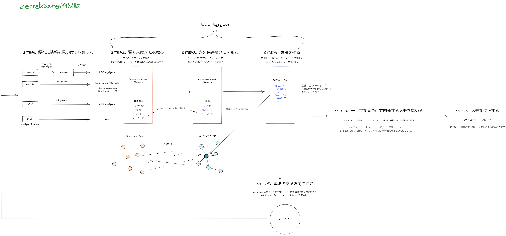
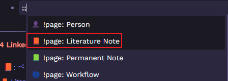
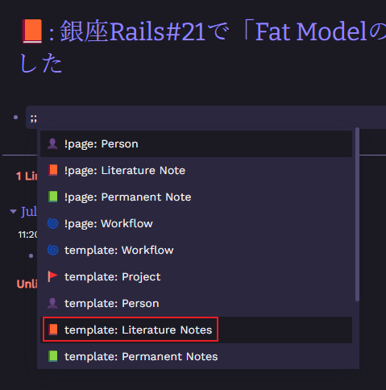
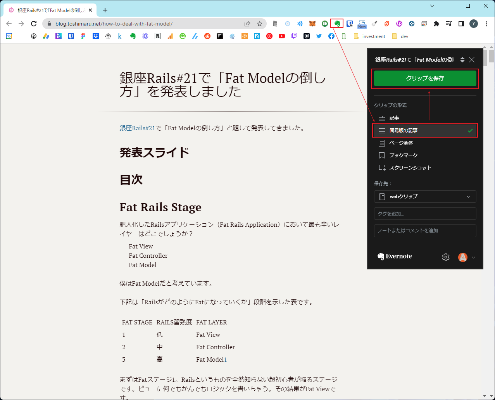
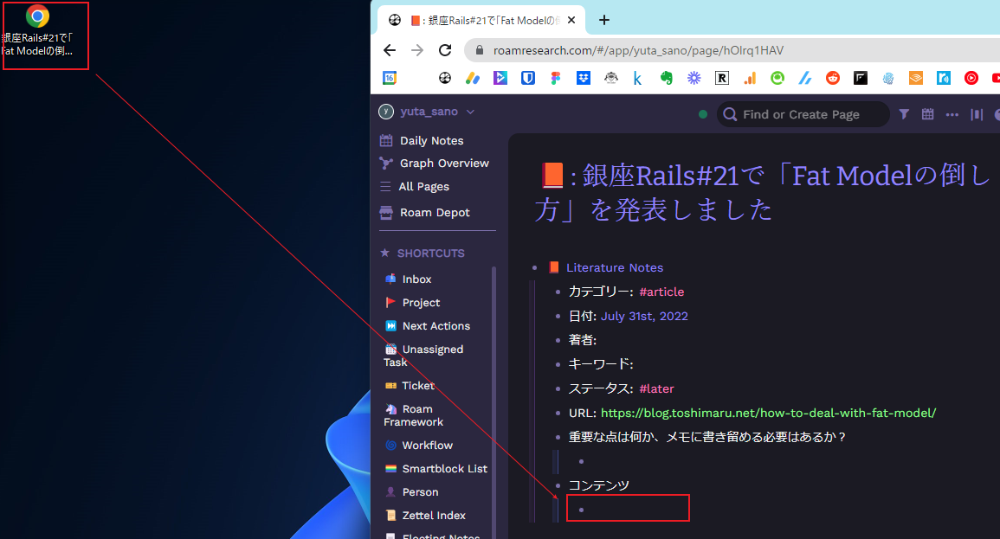
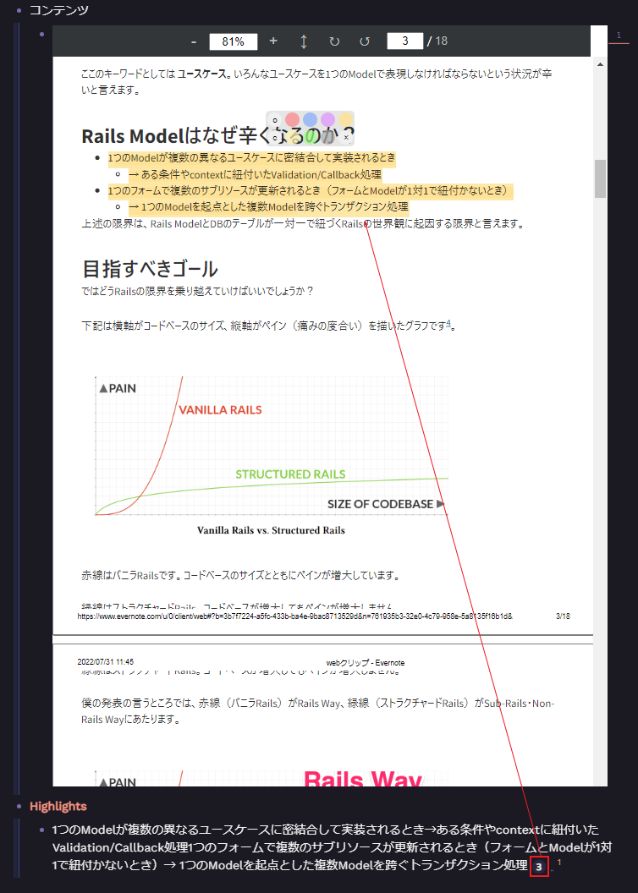
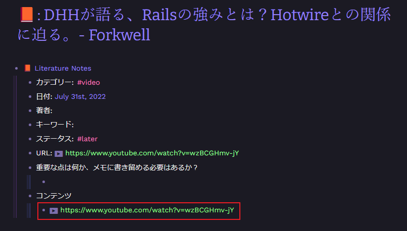
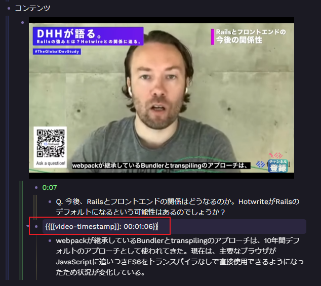
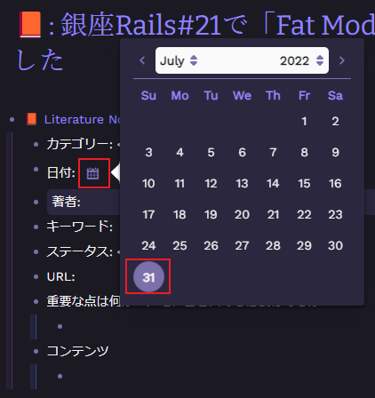

## 前置き

Roam Research を使い始めて半年以上経ちますがいまいち活用しきれていないところがありました。

とくに課題を感じていたのは**アイデアとタスクをどう管理するか**です。

この記事では「**アイデアをどう管理するか**」という課題を解決するために Roam Research でどう実践するかという部分にフォーカスを当てて紹介したいと思います。

## 参考

Roam Research で Zettelkasten を実践する方法の理解を深めるうえで大いに参考にした記事です。

https://roambrain.com/the-complete-guide-for-building-a-zettelkasten-with-roam-research/

また、[TAKE NOTES!――メモで、あなただけのアウトプットが自然にできるようになる](https://www.amazon.co.jp/TAKE-NOTES-%E2%80%95%E2%80%95%E3%83%A1%E3%83%A2%E3%81%A7%E3%80%81%E3%81%82%E3%81%AA%E3%81%9F%E3%81%A0%E3%81%91%E3%81%AE%E3%82%A2%E3%82%A6%E3%83%88%E3%83%97%E3%83%83%E3%83%88%E3%81%8C%E8%87%AA%E7%84%B6%E3%81%AB%E3%81%A7%E3%81%8D%E3%82%8B%E3%82%88%E3%81%86%E3%81%AB%E3%81%AA%E3%82%8B-%E3%82%BA%E3%83%B3%E3%82%AF%E3%83%BB%E3%82%A2%E3%83%BC%E3%83%AC%E3%83%B3%E3%82%B9/dp/4296000411)も Zettelkasten について理解を深めるうえで何度も読み返した本です。メモ取りに書かれている本でこれほど学びや気づきが得られた本は久しぶりでした。

## 従来のメモ取り(トピック別分類)の欠点

従来のメモ取りでは、本、ノート、デジタルツールなどあっちこっちにメモができ、メモを使うときは「いつ」「どこで」書いたかという記憶に頼る必要があります。

デジタルツールで保存するようになってもトピックごとの分類が必要で、メモが増えるたびにどのようなトピックにするか考える必要があります。メモを追加すればするほど見つけづらくなるので、さらにサブトピックを追加することになりますが、メモが増えてきたら問題が新たなトピックやサブトピックに移動するだけで解決しません。

しかし、**[[Zettelkasten]]ではすでに忘れたアイデアでもすぐ出てくるように設計されているため考えるために脳を使うことができます。**

## 私が[[Zettelkasten]]を使う目的

毎日のメモ取りを標準化し、増えたメモから自然とボトムアップでアイデアが発展していき、興味のある方向に進むための道しるべとし、常に興味のあることで学びのループが回っていく好循環のループを作りたい

- メモ取り標準化のメリット
  - あとでアイデアを自由に組み合わせることができる
  - どうメモを取るかで悩まないので、重要なこと、内容、主張、アイデアに集中できる
- 興味のある方向に進むための羅針盤
  - [[Zettelkasten]]のメモは全て自分の興味を持ったテーマなので見返せば興味のある方向に進むことができる

## Zettelkasten 簡易版（図）

[[Zettelkasten]]で文書を書くためのステップを私なりに解釈し整理した図です。

具体的な手順やポイントは省き重要な点のみに絞り図解しています。

別タブで開いて拡大しながら見てください。



## [[Zettelkasten]]で文書を書くための具体的なステップ

### STEP1. 優れた情報を見つけて収集する

**文書を書く旅は、優れた情報源を見つけることから始まります**。

私は本質的な情報を見つけて読むのが好きです。本質的な情報は自分のできることが増えたり、仕事に活かせたり、何より自分の学びに繋がりそこからさらに自分のアイデアを深めることができるからです。

気になる情報に出会ったときに[[Roam Research]]を使って収集します。

記事の場合

- 1. 気になる記事を見つけたら、`;;`で「Literature Note のページタイトル用テンプレート」を呼び出します。

  - 
  - Literature Note のページタイトル用テンプレート
    - ```javascript
      - 📙 !page: Literature Note
        - [[📙:  <Note Title>]]
      ```
    - 絵文字アイコンを使うことで一目で Literature Note と分かるように工夫しています。

- 2. `<Note Title>`部分を記事タイトルに書き換えます。
- 3. 作成したページに移動して、`;;`で「Literature Note のページ用テンプレート」を呼び出し、メタ情報を書き換えます。

  - 
  - Literature Note のページ用テンプレート

    - ```javascript
      - 📙 template: Literature Notes
        - [[📙 Literature Notes]]
          - カテゴリー: <Ctrl+1>
          - 日付: {{date}}
          - 著者:
          - キーワード:
          - ステータス: <Ctrl+2>
          - URL:
          - ## 重要な点は何か、メモに書き留める必要はあるか？
          - ## コンテンツ
      ```

- 4. 「Evernote Web Cliper」を使って記事をクリップします。
  - 私の場合、記事の場合は「URL を貼り付ける場合」と「コンテンツをクリップしたい場合」とがあります。「コンテンツをクリップしたい場合」は[[Roam Research]]内で優れた情報を見つけてハイライトを取りたいときが主です。それ以外の場合は、URL を貼り付けるだけで済ませることも多いです。
  - [Evernote Web Clipper](https://chrome.google.com/webstore/detail/evernote-web-clipper/pioclpoplcdbaefihamjohnefbikjilc#)は広告などを除いたコンテンツのみを保存したいときに非常に便利です。コンテンツ部分のみをクリップするのにとても優れています。また、クリップした記事は Evernote に保存されるため、何らかの理由で記事が見れなくなっても Evernote に保存しておけば見れなくなる心配はありません。また、私の場合は後の手順で PDF 化して[[Roam Research]]に保存するので Evernote がサービス終了しても見れるようにしています。Evernote Web Clipper は、Chrome 拡張機能があるのでインストールします。
  - クリップしたい記事を見つけたら、「Evernote Web Clipper」アイコンをクリック → 「簡易版の記事」を選択 → クリップを保存 で保存します。
    - 
- 5. クリップした記事を PDF に変換します。
  - 記事をクリップしたらコンテンツのみ保存されるため、コンテンツをコピペして[[Roam Research]]に貼り付けるだけでも十分よいのですが、次の点からひと手間かけて PDF に変換します。
    - 記事にコードがある場合、1 行が 1 ブロックで貼り付けられるので表示が崩れてしまう
    - 記事に`#`が使われていると意図しないページが作られる([[Roam Research]]では`#`の後に文字が続くとページになるため)
    - ハイライトを引きたい場合に PDF だと便利
    - PDF だと[[Roam Research]]内で見返すことができる
  - 
  - 
- 6. PDF を[[Roam Research]]に保存します。
  - PDF を[[Roam Research]]にドラッグアンドドロップすると[[Roam Research]]に PDF が保存されます。
  - 
- 7. PDF Highlighter でハイライトします。
  - [[Roam Research]]内で PDF にハイライトをひくために[enhancedPDF](https://github.com/c3founder/Roam-Enhancement#pdf-highlighter)を動くようにする必要があります。
    - インストールや設定などは公式の GitHub の README を見てください。
  - ハイライトを引くと、「Highlights」というブロックができてその下にハイライトした部分のブロックが自動で作成されます。また、ハイライトしたブロックから PDF のハイライト箇所へのリンクも作成されるので PDF のハイライト箇所を辿ることができます。PDF のハイライト上にカーソルを載せるとポップアップメニューがでます。「x」を押すとハイライトをクリアでき、ハイライトしたブロックも自動で消えてくれて便利です。
  - 

YouTube の場合

- 基本は記事と同じです。[[Roam Research]]では、ネイティブ機能として YouTube 動画のタイムスタンプが使えます。動画のタイムスタンプを押しながらメモを取ることができとても便利です。
- 1. Literature Notes を作成しコンテンツ部分に YouTube の URL を貼り付けます。
  - 
- 2. 貼り付けた YouTube の URL の再生アイコンを押して動画を展開します。
  - 
- 3. 動画のブロックの下の子ブロックで Ctrl+Alt+T を押して動画のタイムスタンプを取りながらメモをします
  - 

Kindle の場合

- コンテンツとハイライトは Kindle にあるため、コンテンツとハイライトを眺めながら、ページ数と重要な点を短く自分の言葉でメモ取りします。
- 

### STEP2. 賢く文献メモを取る

優れた情報を見つけて収集したら、忘れたくないこと、アイデア、後で文章に使いたいことを書誌情報と一緒に書き留めます。

- 文献メモのポイント
  - **長さはごく短く、重要なことを、自分の言葉で書く**
  - 真の理解のために書き写さない
  - 引用する場合も厳選して選ぶこと

文献メモを[[Roam Research]]で実践するために私が実際に使っているテンプレートです。

```javascript
- 📙 template: Literature Notes
- [[📙 Literature Notes]]
  - カテゴリー: <Ctrl+1>
  - 日付: {{date}}
  - 著者:
  - キーワード:
  - ステータス: <Ctrl+2>
  - URL:
  - 重要な点は何か、メモに書き留める必要はあるか？
    -
  - コンテンツ
    -
```

- Literature Notes のテンプレートの説明
  - `[[📙 Literature Notes]]`のリンク
    - これは些細なことに見えますが、非常に重要な役割を果たします。Literature Notes 同士で繋がりができるため、後から見返す際にとても便利です。
  - カテゴリー
    - `<Ctrl+1>`部分を削除して、カテゴリーを入力します。カテゴリーを入力するのに[RoamJS の TAG CYCLE](https://roamjs.com/extensions/tag-cycle)を使っています。TAG CYCLE を使うと独自のショートカットキーに独自のタグのサイクルを定義することができます。私は、`Ctrl+1`を押すと、`#book`→`#article`→`#podcast`→`#video`→`#tweet`と切り替わるように設定しています。小さな TIPS ですが、カテゴリを入力する手間を減らしてくれるので TAG CYCLE が好きです。
    - 下記は私の TAG CYCLE の設定です
      - 
  - 日付
    - `{{date}}`部分はデータピッカーになります。今日の日付を選択します。
    - 
  - 著者
    - 著者が分かる場合は著者名をリンクにして入力します。分からない場合は空のままにしておきます。
  - キーワード
    - 後からどの文脈でこのメモを発見したいかを考え、そのキーワードをリンクにして入力します。キーワードは、メモを取った後に考えて入力することが多いです。
  - ステータス
    - `<Ctrl+2>`部分を削除して、ステータスを入力します。ステータスも TAG CYCLE を使っています。私は、`Ctrl+2`を押すと、`#later`→`#process`→`#wrote`→`#referenced`と切り替わるように設定しています。
    - ステータスは Literature Notes のライフサイクルを表現しています。このように**文献メモがどの状態にあるかを定義することで収集しっぱなしにならずにアイデアを発展させるための工夫をしています。**
    - 
  - URL
    - 記事の URL を貼り付けます。
  - 重要な点は何か、メモに書き留める必要はあるか？
    - **読むものすべてに対して「何が興味深いのか」「重要な点は何か、メモに書き留める必要はあるか」を問います。これは、情報の収集コレクターにならないための重要な問いです**。興味を持ったという事は、何かしら自分の既存の知識を発展させるための発見があったシグナルです。それを忘れないうちに、可能な限り元の文献の意味を維持しつつ自分の言葉に書き換えます。真の理解のために書き写さないことも大切です。
  - コンテンツ
    - 引用や PDF などはここに貼り付けます。

### STEP3. 永久保存版メモを取る

「走り書きメモ」と「文献メモ」を見直しながら、内容を整理して「永久保存版メモ」を書きます。
永久保存版メモのポイント

- 1 つのアイデアに 1 つのメモを取ったものです。
- 文献メモを見直してさらに詳しく書いたメモにしたり、浮かんだアイデアから文献メモを参照しながらメモを書いたりします。
- **永久保存版メモは参照情報がなくても誰が読んでもわかる文章で書きます。**
- 「あなたの新しい情報は、すでにある情報と照らし合わせて、対立しますか？修正しますか？補足しますか？付け加えますか？アイデアを組み合わせて新しいものを生み出せないですか？新しい疑問はないですか？」などを考えながら書くことが大事です。

永久保存版メモを[[Roam Research]]で実践するために私が実際に使っているテンプレートです。

```javascript
- 📗 template: Permanent Notes
- [[📗 Permanent Notes]]
  - #ToFile
  - ## ノート:
  - 出典:
  - キーワード:
  - ## 関連ノート:
```

- Permanent Notes のテンプレートの説明
  - `[[📗 Permanent Notes]]`のリンク
    - Permanent Notes 同士で繋がりができるため、後から見返す際にとても便利です。
  - `#ToFile`
    - 「STEP4. 索引を作る」で索引を作ります。このタグがついているノートは索引に載っていないノートという位置づけです。索引に載ったらこのタグを消します。
  - ノート
    - **他の人に読んでもらうつもりで書きます**。このような制約は手間はかかりますが、「重要なメモ」と「重要ではないメモ」をきちんと区別するために重要です。また、1 つのアイデアを 1 つのメモにすることであとでアイデアを自由に組み合わせやすくなります。
  - 出典
    - 出典があれば出典を明記します。出典が文献メモなら文献メモのリンクを貼ります。
  - キーワード
    - 文献メモと同じく、後からどの文脈でこのメモを発見したいかを考え、そのキーワードをリンクにして入力します。
  - 関連ノート
    - 新しく作成した永久保存版メモと関連する永久保存版メモがある場合もリンクを貼ります。**繋がりがあればあるほど、後からこのメモを見返したときに辿れるメモも多くなり、そこから新たなアイデアや主張が生まれやすくなります。**

### STEP4. 索引を作る

文書を書くステップではあってもなくてもいいです

文献メモや永久保存版メモとは独立したメモとして索引を作ります。メモが増えてきたらメモからキーワードをピックアップして作ります。

関連するメモがたくさんある場合やテーマが分かっている場合はそれをまとめた概要メモを作り、メモのリンクを集めてそのメモを起点メモにして索引に追加します。

**起点メモがあれば一連の思考やトピックのメモに自然とたどり着くことができます。**

### STEP5. 興味のある方向に進む

「メモに欠けているものはありませんか？浮かんでくる疑問はありませんか？自分の主張は正しいですか？補強するために文献を読む必要がありますか？」という問いに答えるために必要な文献を探し読みましょう。

**[[Zettelkasten]]ではトピックを探し求めてブレインストーミングする代わりに、メモを見ながら問うことでトピック・疑問・研究プロジェクトなどのテーマは自然とボトムアップで発展していきます。**

しばらくすると、文章のテーマを決められるぐらいアイデアが十分に深まっていくので安心して自分の興味ある方向に進みます。

### STEP6. テーマを見つけて関連するメモを集める

文章のテーマを決められるぐらいアイデアが十分に深まってきたら、関連するメモを集めます。集めたメモは順番に並べて、欠けている情報、重複している情報を探します。

このときに全てがまとまらない場合は一旦寝かせましょう。読書とメモ取りに戻り、アイデアや主張、構造をもっとよいものにしていきます

### STEP7. メモを校正する

筋の通った内容に書き直し、メモから主張を組み立てます

## さいごに

今は情報過多な時代に生きていて、デジタルツールも進化してきてなんでも記録することができます。

**[[Zettelkasten]]について学ぶ中で、走り書きメモや文献メモは最終的は永久保存版メモを作るためのきっかけに過ぎないことを理解することができました。**

今回は[[Zettelkasten]]を[[Roam Research]]で実践する方法について深掘りしました。[[Zettelkasten]]を実践する中でメモは作りっぱなしでは意味がないので、その工夫もテンプレートに組み込んだりしています。作りっぱなしにならないように定期的に見返すというフローも組み込む必要があるのですが、自分も実践中でまだ固まっていないのでレビューフローに関しては固まり次第記事にしたいと思います。

https://twitter.com/snyt45/status/1551582490980421632?ref_src=twsrc%5Etfw
